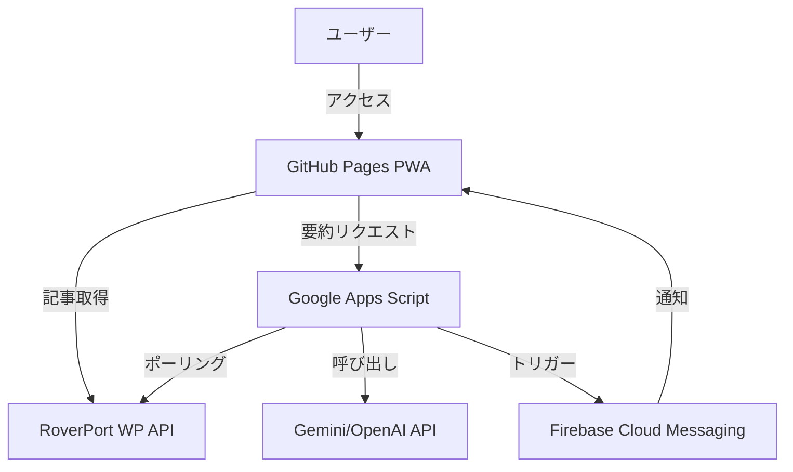

# RoverPort閲覧アプリ - 実装計画書

## 目的
[RoverPort](https://roverport.rcjweb.jp/) のブログ記事を可視化する、リッチでモダンなプログレッシブウェブアプリ（PWA）を構築します。アプリはGitHub Pagesでホストし、サーバーサイドのロジック（AI、プッシュ通知）が必要な部分にはGoogle Apps Script（GAS）を使用します。

## ユーザーレビュー事項
 > [!IMPORTANT]
 > **APIアクセス:** RoverPortがWordPress REST APIを公開しており、CORS（クロスオリジン通信）を許可していることを確認しました。ブラウザから直接データを取得可能です。
 > **主な制約:**
 > - ホスティング: GitHub Pages（静的サイト）。
 > - バックエンド: Google Apps Script (GAS)。
 > - **AI & プッシュ通知:** APIキーやバックグラウンドジョブが必要なため、GASで処理します。

## アーキテクチャ

## 変更案

### 技術スタック
- **フロントエンド:** Vite + React + TypeScript
- **スタイリング:** Tailwind CSS（リッチでモダンなUI） + Framer Motion（アニメーション）
- **ホスティング:** GitHub Pages
- **バックエンド（サーバーレス）:** Google Apps Script (GAS)
- **プッシュ通知構成:** Firebase Cloud Messaging (FCM) - 無料枠

### コンポーネント

#### [NEW] フロントエンド (Vite App)
- **セットアップ:** React/TSで `vite` プロジェクトを初期化。
- **UI:**
    - `PostCard`: カバー画像、著者、タグを含むリッチなカードコンポーネント。
    - `Feed`: 無限スクロールまたはページネーション付きのカードグリッド。
    - `pwa-plugin`: マニフェストとService Worker用のVite PWAプラグイン。
- **ロジック:**
    - `usePosts`: Hook to fetch from `https://roverport.rcjweb.jp/wp-json/wp/v2/posts?_embed`. Supports `author`, `tags`, and `orderby` params.
    - `useAttributes`: Hook to fetch available Authors and Tags for filter dropdowns.
    - `useAISummary`: Hook to call GAS endpoint for summary.

#### [NEW] Feature: Filtering & Sorting
- **FilterBar Component:**
    - Dropdown for **Authors** (fetched from `/wp/v2/users`).
    - Dropdown for **Tags** (fetched from `/wp/v2/tags`).
    - Sort Toggle: Latest vs Oldest (since "Likes" aren't standard, we prioritize Date).
- **State Management:**
    - Lift state to `Feed` or `App` to trigger re-fetches when filters change.

#### [NEW] バックエンド (GAS)
- **スタンドアロンスクリプト:** GASプロジェクトを作成（リポジトリとは別、または管理用）。
- **関数:**
    - `doGet`: AI要約プロキシ用のAPIエンドポイント。
    - `checkNewPosts`: 新しい記事をWP APIでチェックする時間主導トリガー（10〜15分ごと）。
    - `sendPush`: FCMトークン（GoogleスプレッドシートまたはFirestoreに保存）に通知を送信。

## 検証計画

### 自動テスト
- **フロントエンド単体テスト:** コンポーネント用のVitest。
- **ビルド検証:** `npm run build` が有効な静的サイトを生成することを確認。

### 手動検証
- **API接続:** ブラウザコンソールでWP APIレスポンスを確認。
- **PWAインストール:** モバイル/デスクトップにインストールし、オフライン起動を確認。
- **プッシュ通知:** GASからテストプッシュをトリガーし、デバイスで受信することを確認。
- **AI要約:** 「要約」ボタンをクリックし、GASからのレスポンスを確認。
